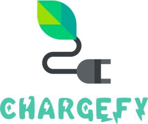

<h1 align="center">
    
</h1>

  <a href="#-tecnologias">Tecnologias</a>&nbsp;&nbsp;&nbsp;|&nbsp;&nbsp;&nbsp;
  <a href="#-projeto">Projeto</a>&nbsp;&nbsp;&nbsp;|&nbsp;&nbsp;&nbsp;
  <a href="#-layout">Layout</a>&nbsp;&nbsp;&nbsp;|&nbsp;&nbsp;&nbsp;
  <a href="#memo-licença">Licença</a>

<!-- 
 
  -->

  

 

## Tecnologias

Este projeto foi desenvolvido com as seguintes tecnologias

- [Node.js](https://nodejs.org/en/)
- [React](https://reactjs.org)
- [React Native](https://facebook.github.io/react-native/)
- [TypeScript](https://www.typescriptlang.org/)
- [Expo](https://expo.io/)

## Projeto

Chargefy é um serviço web que facilita o encontro de postos de carregamento elétrico 🍃

## :memo: Licença

Esse projeto está sob a licença MIT. Veja o arquivo [LICENSE](LICENSE.md) para mais detalhes.

---

Made with 💚 by [Pedro Assunção](https://github.com/Pedroassuncao) & [Pedro Rodrigues](https://github.com/PedroRodrigues99)
